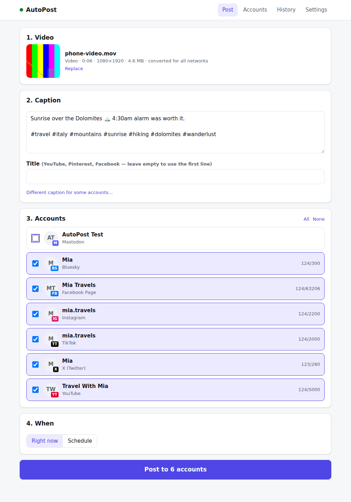

# Fifofarm — one video, all your accounts, one click

Drop a video into Fifofarm, write one caption, press **Post**. It goes out to
every account you've connected: YouTube, TikTok, Instagram, Facebook, Threads,
X, LinkedIn, Pinterest, Bluesky, Mastodon, as many accounts per network as you
like. Post now or schedule it, watch each account turn green as it publishes,
and see how every video does in **Analytics**. Your team signs up with their
own email and password and works with their own accounts.

Everything is open source and self-hosted. There are no subscriptions and no
post limits. The only costs are a server (free or ~€5.50/month, see
[docs/hosting.md](docs/hosting.md)) and X's per-post API fee if you use X.



> The folder is still called `autopost/` (the project's first name). Fifofarm's
> data lives in Docker volumes named after it, so the folder and the compose
> project name stay as they are.

## How it works

```
 you ──► Fifofarm ──► Postiz ──► YouTube, TikTok, Instagram, …
         (dashboard/)  (engine)
```

- **Fifofarm** (`dashboard/`) is the control panel you use. It:
  - converts any video (iPhone `.mov`, 4K, HEVC, 10-bit…) into a file every
    network accepts
  - fills in each network's required settings for you
  - shortens captions that are too long for a network (X's 280 characters)
  - posts to every selected account in one click ("All Instagram",
    "All TikTok" chips when you have many accounts)
  - shows live per-account status, with "Retry failed" when something goes
    wrong
  - walks you through each network's developer app and applies the keys
    itself — no `.env` editing, no terminal
  - **team accounts:** everyone signs in with their own email and password.
    Members see and post to only the accounts they connected (and their own
    History and Analytics); the owner sees everything, can move an account to
    someone, reset passwords, remove people and close sign-up
  - **analytics:** views, likes, comments, shares, saves and reach for every
    post (checked hourly while new, then less often), views per day, account
    numbers from each network (followers, reach…) and the best hour to post
- **[Postiz](https://github.com/gitroomhq/postiz-app)** (open source) is the
  engine. It does the actual talking to each network: sign-in (OAuth), token
  refresh, uploads, retries, and checking that the post went live. Fifofarm
  creates its account and API key automatically; you never need to open it.
- **Watchdog**: Postiz has a known bug where its background worker silently
  stops picking up posts. Fifofarm checks for exactly that and restarts Postiz
  automatically. Anything queued meanwhile still goes out.
- **Server helper** (`scripts/maintain.sh`, cron, every minute): applies
  network keys and domain changes saved in Fifofarm, and installs new versions
  of the tracked branch (`main`) by itself within 5 minutes. If a new version
  doesn't start, it puts the previous one back by itself.

## Quick start

On a server (Ubuntu, e.g. Oracle Cloud free tier or Hetzner), with a domain
pointing at it (a free `yourname.duckdns.org` works):

```sh
git clone https://github.com/fifohudak-boop/AI-models.git fifofarm
cd fifofarm/autopost
sh install.sh
```

The installer asks three things — computer or server, your domain, a password —
and does the rest: installs Docker if needed, opens the firewall, waits until
your domain points to the server, starts everything, creates the Postiz
account, and turns on automatic updates. It ends by printing your address and
password.

Then, in Fifofarm:

1. **Accounts → a network → Set up**: follow the steps shown (they include the
   exact addresses to paste into the network's developer site), paste the two
   keys, **Save keys**. Fifofarm applies them within a minute or two.
2. **Connect** the account. More accounts: **+ Add another** (the network asks
   which account to use) or **Send link** (open it on the phone where that
   account is logged in, or send it to whoever owns the account).
3. **Post** page → drop video → caption → **Post to N accounts**.
4. **Your team:** Settings → Your account → add your email (from then on you
   sign in with it). Settings → Team shows the sign-up link to send your team;
   turn sign-up off once everyone has joined.

**On a Mac with Claude Cowork?** See [docs/mac-with-cowork.md](docs/mac-with-cowork.md).

## Your own computer vs. a server

| | Your computer | Server with a domain |
|---|---|---|
| Cost | €0 | €0 (Oracle free tier) or ~€5.50/month |
| YouTube, X, LinkedIn, Bluesky, Mastodon | ✓ | ✓ |
| TikTok, Instagram, Facebook, Threads, Pinterest | ✗ (they need a public https address) | ✓ |
| Scheduled posts while you sleep | only if the computer stays on | ✓ |
| Automatic updates, keys applied from Settings | ✗ | ✓ |

Server setup, including the free option and a free domain:
**[docs/hosting.md](docs/hosting.md)**.

## Things the networks require (no tool can skip these)

- **Instagram:** only Professional (Business/Creator) accounts can be posted
  to by apps. Switching is free. Until Meta approves your app (App Review),
  every Instagram account must be added as an **Instagram Tester** and accept
  the invite — Fifofarm shows how next to **+ Add another**.
- **TikTok:** until TikTok approves your developer app, posts are "Only me",
  the account must be private and at most 5 accounts can post per day.
- **YouTube:** until Google approves your API project (a free form), uploads
  arrive as **private**. Also publish your Google OAuth app ("In production"),
  or YouTube disconnects every 7 days.
- **Facebook:** switch your Meta app to **Live**, or posts are only visible to
  you.
- **X:** posting via the API costs about $0.015 per post, prepaid.

Developer apps ask for a Terms of Service and Privacy Policy address: use
`https://<your domain>/legal/terms` and `/legal/privacy` (data deletion:
`/legal/data-deletion`). They're built in.

## Everyday use

- **Post:** drop a video (or a photo), write the caption, untick any accounts
  you want to skip (or tap a network chip to toggle all of its accounts), then
  post now or schedule.
- **History:** every post with each account's status and a link to the live
  post. **Retry failed** re-sends only to the accounts that failed.
  **Delete** cancels anything not yet published.
- **Accounts:** connect, add more, send connect links, disconnect, choose a
  Pinterest board, set up new networks, and (owner) choose who an account
  belongs to.
- **Analytics:** totals for 7/30/90 days, views per day, every account (click
  it for followers, reach and more) and every post (click it for its growth
  and the same post on your other accounts), best time to post. **Refresh now**
  fetches fresh numbers; otherwise they update by themselves.
- **Settings:** your name, email and password; (owner) the team, version and
  automatic updates, domain, YouTube visibility, TikTok privacy, who can reply
  on X, caption shortening.

## Running it

```sh
docker compose ps             # is everything up? (postiz shows "healthy" when posting works)
docker compose logs -f dashboard postiz watchdog
docker compose restart        # restart everything
docker compose down           # stop (your data stays)
tail -f runtime/maintain.log  # what the server helper did (applies, updates)
```

**Updates** install themselves on servers (`scripts/enable-auto-update.sh`
turns that on; the installer does it for you). Settings shows the installed
version and has **Check for updates now**. A version that fails to build is
not installed: the previous one keeps running. Postiz is pinned to the version
Fifofarm was tested with (`POSTIZ_VERSION` in `.env`).

**Moving to your own domain:** point `yourdomain` and `postiz.yourdomain` to
the server, then Settings → Domain. Afterwards add the new redirect URLs in
each network's developer app (Accounts → network → Setup shows them).

**Backups:** everything lives in Docker volumes. To back up the database:

```sh
docker compose exec -T postgres pg_dumpall -U postiz > backup.sql
```

Your uploaded media is in the `autopost_postiz-uploads` volume; Fifofarm's own
data (team accounts, post history, analytics) is in `autopost_dashboard-data`.

## Troubleshooting

| Problem | Fix |
|---|---|
| "Getting Fifofarm ready…" | The posting engine's very first start takes up to 10 minutes. The page continues by itself. |
| Yellow banner "posting engine isn't picking up posts" | The watchdog restarts Postiz within ~5 minutes; queued posts go out after. If it stays, run `docker compose restart postiz`. |
| Saved keys don't apply | Settings → the first card must say "automatic updates on". If not, run `sh scripts/enable-auto-update.sh` once on the server. |
| Sign-in window shows "redirect_uri mismatch" / "Invalid redirect" | Copy the redirect URL from Accounts → network → Setup into the network's developer app exactly. |
| Instagram: "Insufficient developer role" | Add the account as Instagram Tester and accept the invite (Accounts → Instagram → How?). |
| TikTok fails with "privacy level" or "unaudited" | Settings → TikTok → *Only me*, and set your TikTok account to private, until TikTok approves your app. |
| YouTube videos are private | Expected until Google's API audit passes, see above. |
| An account fails with "reconnect" | Its login expired; click **+ Add another** for that network and log in to it again. |
| A team member forgot their password | Settings → Team → **New password**, then send it to them. |
| The owner forgot the password | On the server: `docker compose exec dashboard node server/reset-password.js` prints a new one (add someone's email to reset theirs). |
| Analytics says "No numbers yet" | Networks take up to an hour to report numbers for a new post. Bluesky, Mastodon and LinkedIn profiles don't share numbers with apps. |

## What's in this folder

```
install.sh               one-command setup
docker-compose.yml       the whole stack
.env.example             every setting, explained
Caddyfile                automatic HTTPS (server mode)
scripts/maintain.sh      server helper: applies settings, installs updates (cron)
scripts/enable-auto-update.sh   turns the helper on
postiz-healthcheck.js    "is Postiz really posting?" check used by the watchdog
dashboard/               Fifofarm itself (Node + React)
docs/                    network setup, hosting, screenshots
test/                    end-to-end and outage tests (see test/README.md)
```

## Tests

- **Unit + server tests:** `cd dashboard && npm test` (includes the whole
  server against a fake Postiz: automatic setup, the owner staying signed in
  through updates, sign-up, who sees which account, network keys, add-another
  links, verification files, password changes, analytics).
- **End-to-end:** `test/run-e2e.sh`. It starts the real stack plus a fake
  Mastodon server, drives Fifofarm in a real browser, and checks what
  "Mastodon" received.
- **Outage test:** `test/watchdog.mjs` freezes Postiz's worker, posts during
  the outage, and checks the watchdog recovers and the post goes out by
  itself.

Details in [test/README.md](test/README.md).
